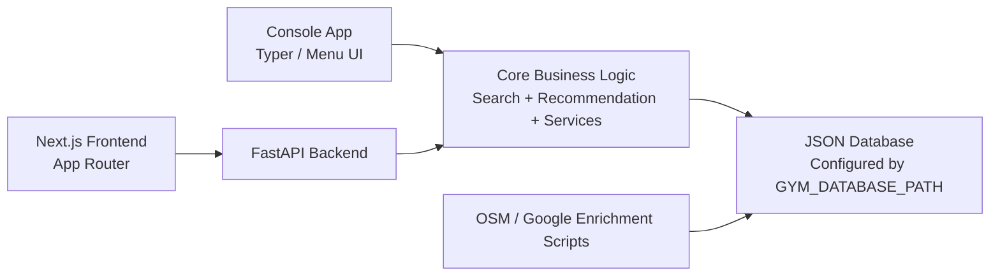

# Gym Recommendation System

Gym Recommendation System is a Python-first project for browsing, filtering, comparing, recommending, and maintaining gym records from a shared JSON database. The console app is the assignment-safe deliverable, while the FastAPI backend and Next.js frontend provide a strong showcase layer for demos and presentations.

The system runs on a larger Singapore gym dataset and supports both offline operation and optional map-data enrichment workflows.

## Executive Summary

This project addresses a real user problem: choosing a gym depends on more than price or rating. Location, operating hours, facilities, classes, and personal goals all matter. The system brings those factors together into one searchable and recommendable dataset.

At a high level, the project provides:
- A console application for assignment-safe use without browser dependencies.
- A FastAPI backend that exposes the same logic as JSON endpoints.
- A Next.js frontend with pages for browsing, recommending, comparing, and administering gyms.
- A shared JSON database used by both console and web flows.
- Utility scripts to import or enrich gym data from OpenStreetMap and Google Maps.

## System Architecture



### Architectural Layers

1. Presentation Layer
   - Python console UI for the primary deliverable
   - Next.js web UI for demo and presentation purposes

2. Application Layer
   - FastAPI routes validate requests and expose the shared service layer
   - Service functions coordinate loading, searching, scoring, comparing, creating, and updating data

3. Domain Logic Layer
   - Search logic handles filtering, sorting, and distance computation
   - Recommendation logic computes match scores and explanation strings

4. Data Layer
   - A JSON file is the single source of truth at runtime
   - The active dataset path is configured through `.env`

5. Data Acquisition Layer
   - OpenStreetMap import and enrichment scripts
   - Google Places enrichment script

## Repository Structure

- `data/gyms_osm_sg.json`
  Default runtime dataset used by the app and API.
- `data/gyms.json`
  Original smaller seed dataset retained for reference.
- `src/gym_recommender/main.py`
  Console entrypoint.
- `src/gym_recommender/ui.py`
  Interactive menu workflows for the console version.
- `src/gym_recommender/data.py`
  Database loading, saving, and ID generation.
- `src/gym_recommender/search.py`
  Filtering, sorting, and distance calculations.
- `src/gym_recommender/recommendation.py`
  Match scoring and recommendation reasoning.
- `src/gym_recommender/services.py`
  Shared orchestration layer between API and data logic.
- `src/gym_recommender/api.py`
  FastAPI endpoints for the frontend and external clients.
- `src/gym_recommender/osm_import.py`
  OSM import pipeline that converts map data into the app’s schema.
- `src/gym_recommender/google_maps_enrichment.py`
  Google Places enrichment utilities.
- `src/gym_recommender/openstreetmap_enrichment.py`
  OSM enrichment utilities.
- `scripts/start_app.py`
  Launcher for console, API, web, and full-stack demo flows.
- `scripts/import_osm_gyms.py`
  Bulk import script for larger OpenStreetMap datasets.
- `scripts/fetch_google_maps_data.py`
  Google Places enrichment script.
- `scripts/fetch_openstreetmap_data.py`
  OpenStreetMap enrichment script.
- `web/`
  Next.js presentation frontend.
- `tests/`
  Unit tests for search, recommendation, API behavior, and import/enrichment helpers.

## Core Functional Capabilities

### 1. Gym Discovery

Users can browse the dataset and inspect essential information:
- Area
- Address
- Monthly price
- Day-pass price
- Rating
- Operating hours
- Gym type
- Facilities

### 2. Search and Filter

Filters supported:
- Area
- Maximum budget
- Minimum rating
- Required facilities
- Operating time
- 24-hour availability
- Female-friendly preference
- Classes availability
- Gym type

Sort options:
- Price
- Rating
- Distance
- Recommendation score

### 3. Personalized Recommendation

The recommendation engine combines hard filters and weighted scoring based on:
- Preferred area
- Budget
- Minimum rating
- Preferred facilities
- Preferred gym type
- Preferred workout time
- User location
- Fitness goal
- Skill level
- Class requirement
- Female-friendly preference

The recommendation score includes:
- Rating score
- Price score
- Distance score
- Facility overlap score
- Goal/environment score

Each recommendation includes a human-readable reason string for explainability.

### 4. Side-by-Side Comparison

Users can compare 2 or 3 gyms and view key attributes in a single comparison table.

### 5. Data Maintenance

The admin workflow supports:
- Creating new gym records
- Updating existing gym records
- Saving changes back into the active JSON database

## Current Pages And Demo Features

### Home Page `/`

Purpose:
Introduce the product and make the value proposition obvious within the first screen.

Presentation-friendly highlights:
- Hero section with strong product framing
- Dataset size displayed as a live metric from the backend
- Recommendation/scoring positioning for non-technical audiences
- Featured gym cards to quickly show the system is data-driven
- Error banner if the backend is offline

Good talking points during demo:
- “This is the landing page that summarizes the system in one view.”
- “The dataset count is dynamic, so the frontend is not hardcoded.”
- “Featured gyms come from the shared backend used by the rest of the product.”

### Browse Page `/browse`

Purpose:
Allow users to search the full gym database and sort matching records.

Current user inputs:
- Area
- Maximum budget
- Minimum rating
- Gym type
- Required facilities
- Sort key
- User X / Y coordinates for distance-based sorting

## Environment Variables

- `GYM_DATABASE_PATH`
- `GOOGLE_MAPS_API_KEY`
- `GOOGLE_MAPS_COUNTRY_HINT`
- `GOOGLE_MAPS_MAX_RECORDS`
- `GOOGLE_MAPS_REFRESH_EXISTING`
- `GOOGLE_MAPS_THROTTLE_SECONDS`
- `NOMINATIM_EMAIL`
- `OSM_COUNTRY_HINT`
- `OSM_THROTTLE_SECONDS`
- `OVERPASS_API_URL`
- `NEXT_PUBLIC_API_BASE_URL`
- `CORS_ALLOW_ORIGINS`

## Setup And Run

### Install Python Dependencies

```bash
uv sync
```

### Run The Console App

```bash
uv run gym-recommender
```

### Run The API

```bash
uv run uvicorn gym_recommender.api:app --reload
```

### Run The Web UI

```bash
cd web
npm install
npm run dev
```

Notes:
- Recommended Node.js version: 22 LTS (or newer). The console app does not require Node.js.
- If you are on Node 25+, Next.js dev overlay requires a localStorage file. Use:
  `NODE_OPTIONS="--localstorage-file=/tmp/node-localstorage.json" npm run dev`

### Run Through The Launcher Script

```bash
uv run python scripts/start_app.py console
uv run python scripts/start_app.py api
uv run python scripts/start_app.py install_web
uv run python scripts/start_app.py web
uv run python scripts/start_app.py fullstack
```

Launcher options:
- `uv run python scripts/start_app.py web --api-base-url http://127.0.0.1:8000 --port 3000`
- `uv run python scripts/start_app.py fullstack --host 127.0.0.1 --port 8000 --web-port 3000`

The launcher automatically sets a localStorage file for Node-based dev servers to avoid Next.js overlay errors.

## Suggested Presentation Demo Flow

1. Start on the home page
   - Show the live dataset size and explain the system goal.
2. Move to Browse
   - Filter by area, budget, and sort order to show backend-driven search.
3. Move to Recommend
   - Enter a user profile and explain that the results are ranked, not merely filtered.
4. Move to Compare
   - Compare 2-3 shortlisted gyms and show how the table supports decision making.
5. Move to Admin
   - Demonstrate that the system can maintain its own dataset.
6. Mention the console mode
   - Explain that the assignment-safe fallback still exists and uses the same core logic.

## Why This System Is Demo-Friendly

- It has a clear user problem and a visible solution.
- It supports both deterministic filtering and recommendation logic.
- It has multiple interfaces over one shared backend model.
- It can run offline for safer classroom use.
- It is easy to explain from architecture, feature, and user-flow perspectives.

## Development Checks

Run the main checks with:

```bash
uv run ruff format .
uv run ruff check .
uv run ty check
uv run python -m unittest
```

For a quick Python-only verification:

```bash
PYTHONPATH=src python3 -m unittest
PYTHONPYCACHEPREFIX=.pycache PYTHONPATH=src python3 -m compileall src tests
```

## Notes And Limitations

- The console application remains the primary deliverable and fallback demo path.
