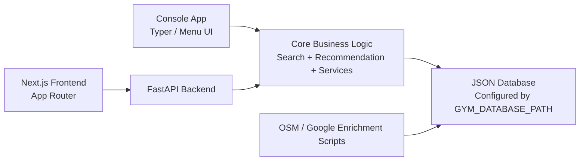

# Gym Recommendation System

Gym Recommendation System is a Python-first project for browsing, filtering, comparing, recommending, and maintaining gym records from a shared offline JSON database. The core assignment-safe deliverable is the console application, while the FastAPI backend and Next.js frontend provide a stronger showcase layer for demos, presentations, and future extension.

The system currently runs on a larger Singapore gym dataset and supports both local-only operation and optional map-data enrichment workflows.

## Executive Summary

This project solves a common user problem: choosing a gym is not only about price or rating, but also about location, operating hours, facilities, classes, beginner-friendliness, and personal goals. The system brings those factors together into one searchable and recommendable dataset.

At a high level, the project provides:

- A console application for assignment-safe use without browser dependencies
- A FastAPI backend that exposes the same logic as JSON endpoints
- A Next.js frontend with separate pages for browsing, recommending, comparing, and administering gyms
- A shared JSON database used by both console and web flows
- Utility scripts to import or enrich gym data from OpenStreetMap and Google Maps

## System Architecture



### Architectural Layers

1. Presentation Layer
   - Python console UI for the primary deliverable
   - Next.js web UI for demo and presentation purposes

2. Application Layer
   - FastAPI routes validate requests and expose the shared service layer
   - Service functions coordinate loading, searching, scoring, comparing, creating, and updating data

3. Domain Logic Layer
   - Search logic handles filtering, sorting, and distance computation
   - Recommendation logic computes match scores and explanation strings

4. Data Layer
   - A JSON file is the single source of truth at runtime
   - The active dataset path is configured through `.env`

5. Data Acquisition Layer
   - OpenStreetMap import and enrichment scripts
   - Google Places enrichment script

## Repository Structure

- `data/gyms_osm_sg.json`
  Current default runtime dataset used by the app and API.
- `data/gyms.json`
  Original smaller seed dataset retained for reference.
- `src/gym_recommender/main.py`
  Console entrypoint.
- `src/gym_recommender/ui.py`
  Interactive menu workflows for the console version.
- `src/gym_recommender/data.py`
  Database loading, saving, and ID generation.
- `src/gym_recommender/search.py`
  Filtering, sorting, and distance calculations.
- `src/gym_recommender/recommendation.py`
  Match scoring and recommendation reasoning.
- `src/gym_recommender/services.py`
  Shared orchestration layer between API and data logic.
- `src/gym_recommender/api.py`
  FastAPI endpoints for the frontend and external clients.
- `src/gym_recommender/osm_import.py`
  OSM import pipeline that converts map data into the app’s schema.
- `src/gym_recommender/google_maps_enrichment.py`
  Google Places enrichment utilities.
- `src/gym_recommender/openstreetmap_enrichment.py`
  OSM enrichment utilities.
- `scripts/start_app.py`
  Launcher for console, API, web, and full-stack demo flows.
- `scripts/import_osm_gyms.py`
  Bulk import script for larger OpenStreetMap datasets.
- `scripts/fetch_google_maps_data.py`
  Google Places enrichment script.
- `scripts/fetch_openstreetmap_data.py`
  OpenStreetMap enrichment script.
- `web/`
  Next.js presentation frontend.
- `tests/`
  Unit tests for search, recommendation, API behavior, and import/enrichment helpers.

## Core Functional Capabilities

### 1. Gym Discovery

Users can browse the gym dataset and inspect essential information including:

- Area
- Address
- Monthly price
- Day-pass price
- Rating
- Operating hours
- Gym type
- Facilities

### 2. Search and Filter

The search engine supports filtering by:

- Area
- Maximum budget
- Minimum rating
- Required facilities
- Operating time
- 24-hour availability
- Female-friendly preference
- Classes availability
- Gym type

The result list can then be sorted by:

- Price
- Rating
- Distance
- Recommendation score

### 3. Personalized Recommendation

The recommendation engine combines hard filters and weighted scoring to return the top matches based on:

- Preferred area
- Budget
- Minimum rating
- Preferred facilities
- Preferred gym type
- Preferred workout time
- User location
- Fitness goal
- Skill level
- Class requirement
- Female-friendly preference

The recommendation score includes:

- Rating score
- Price score
- Distance score
- Facility overlap score
- Goal and environment score

Each recommendation also returns a human-readable reason string for demo explainability.

### 4. Side-by-Side Comparison

Users can compare 2 or 3 distinct gyms directly and view key attributes in a single comparison table.

### 5. Data Maintenance

The admin workflow supports:

- Creating new gym records
- Updating existing gym records
- Saving changes back into the active JSON database

## Current Pages And Demo Features

### Home Page `/`

Purpose:
Introduce the product and make the value proposition obvious within the first screen.

Presentation-friendly highlights:

- Hero section with strong product framing
- Dataset size displayed as a live metric from the backend
- Recommendation/scoring positioning for non-technical audiences
- Featured gym cards to quickly show the system is data-driven
- Error banner if the backend is offline

Good talking points during demo:

- “This is the landing page that summarizes the system in one view.”
- “The dataset count is dynamic, so the frontend is not hardcoded.”
- “Featured gyms come from the shared backend used by the rest of the product.”

### Browse Page `/browse`

Purpose:
Allow users to search the full gym database and sort matching records.

Current user inputs:

- Area
- Maximum budget
- Minimum rating
- Gym type
- Required facilities
- Sort key
- User X / Y coordinates for distance-based sorting

What the page demonstrates well:

- Form-to-API interaction
- Real filtering against backend logic
- Dynamic success, empty-state, and error messages
- Reusable card rendering for results

Presentation talking points:

- “This page demonstrates the filtering engine.”
- “The frontend is thin; the backend owns the actual business logic.”
- “Distance sorting requires user coordinates and is validated server-side.”

### Recommendation Page `/recommend`

Purpose:
Showcase the personalized recommendation engine rather than simple filtering.

Current user inputs:

- Preferred area
- Budget
- Minimum rating
- Preferred facilities
- Preferred time
- Fitness goal
- Skill level
- Preferred gym type
- Female-friendly requirement
- Classes requirement
- User X / Y coordinates

What the page demonstrates well:

- Recommendation-specific form design
- Weighted scoring logic
- Top-match response flow
- Explanatory recommendation reason shown on each card

Presentation talking points:

- “This is the intelligent layer of the system.”
- “The output is not just filtered, it is ranked.”
- “The score is explainable, which is important for user trust.”

### Compare Page `/compare`

Purpose:
Help users shortlist and compare multiple options side by side.

Current behavior:

- Accepts 2 or 3 comma-separated gym IDs
- Rejects duplicates and invalid comparison sizes
- Displays the selected gyms in a comparison table

Comparison fields shown:

- Area
- Monthly price
- Day pass
- Rating
- Hours
- Gym type
- Classes availability
- Female-friendly support
- Facilities
- Recommendation score when available

Presentation talking points:

- “This page supports the shortlist decision stage.”
- “Validation happens before the comparison is accepted.”
- “It is a simple but useful workflow for users choosing between final candidates.”

### Admin Page `/admin`

Purpose:
Demonstrate maintenance of the shared dataset through the web layer.

Current capabilities:

- Toggle between create and update mode
- Load an existing gym into the form
- Submit create and update requests to the FastAPI backend
- Save directly into the JSON database

Presentation talking points:

- “The system is not read-only.”
- “The same database supports search, recommendation, comparison, and maintenance.”
- “This helps show extensibility beyond the baseline coursework features.”

## Console Application

The console application remains the safest fallback mode for assessment because it does not require Node.js or a browser. It reads directly from the configured JSON dataset and uses the same search and recommendation logic as the API-backed flows.

This makes it a strong submission path because:

- It works fully offline
- It is not dependent on frontend tooling
- It still demonstrates the core data model and decision logic

## API Design

Base URL:

- `http://127.0.0.1:8000`

Available endpoints:

- `GET /api/health`
  Health check for frontend readiness.
- `GET /api/gyms`
  Returns all gyms as serialized API responses.
- `GET /api/gyms/{gym_id}`
  Returns one gym or `404`.
- `POST /api/search`
  Applies filters and sort logic.
- `POST /api/recommend`
  Returns ranked top recommendations.
- `POST /api/compare`
  Compares 2-3 distinct gyms.
- `POST /api/gyms`
  Creates a new gym record.
- `PUT /api/gyms/{gym_id}`
  Updates an existing gym record.

The backend also enables:

- Localhost-friendly CORS defaults for demo use
- Shared serialization so the web UI sees consistent gym payloads
- Validation via Pydantic request models

## Data Model Summary

Each gym record includes fields such as:

- `gym_id`
- `gym_name`
- `area`
- `address`
- `x_coordinate`
- `y_coordinate`
- `monthly_price`
- `day_pass_price`
- `rating`
- `opening_time`
- `closing_time`
- `is_24_hours`
- `gym_type`
- `facilities`
- `beginner_friendly`
- `female_friendly`
- `student_discount`
- `peak_crowd_level`
- `parking_available`
- `near_mrt`
- `trainer_available`
- `classes_available`

Some imported records may also carry nested map metadata such as:

- `openstreetmap`
- `google_maps`

## Dataset And Import Pipeline

### Active Runtime Dataset

The app currently uses:

- `data/gyms_osm_sg.json`

This path is controlled by:

- `GYM_DATABASE_PATH` in the root `.env`

### OpenStreetMap Import

The OSM import pipeline fetches gym and fitness-centre records and normalizes them into the app schema.

What it does:

- Pulls map records from Overpass
- Normalizes names, coordinates, areas, addresses, and facilities
- Uses reverse geocoding to improve area labels
- Writes a presentation-ready JSON file for the app

Run it:

```bash
PYTHONPATH=src python3 scripts/import_osm_gyms.py --limit 200 --output data/gyms_osm_sg.json
```

### Google Places Enrichment

Use the Google enrichment flow when you want richer commercial metadata such as:

- Place ID
- Maps link
- Website
- Phone number
- Opening-hours summaries
- Live rating and rating-count information

Run it:

```bash
PYTHONPATH=src python3 scripts/fetch_google_maps_data.py --output data/gyms.enriched.json
```

### OpenStreetMap Enrichment

Use the OSM enrichment flow when you want open-data metadata added as a nested block.

Run it:

```bash
PYTHONPATH=src python3 scripts/fetch_openstreetmap_data.py --output data/gyms.osm.json
```

## Environment Configuration

The root `.env` currently supports:

- `GYM_DATABASE_PATH`
- `GOOGLE_MAPS_API_KEY`
- `NOMINATIM_USER_AGENT`
- `NOMINATIM_EMAIL`
- `OSM_COUNTRY_HINT`
- `OSM_THROTTLE_SECONDS`
- `OVERPASS_API_URL`
- `NEXT_PUBLIC_API_BASE_URL`
- `CORS_ALLOW_ORIGINS`

## Setup And Run

### Install Python Dependencies

```bash
uv sync
```

### Run The Console App

```bash
uv run gym-recommender
```

### Run The API

```bash
uv run uvicorn gym_recommender.api:app --reload
```

### Run The Web UI

```bash
cd web
npm install
npm run dev
```

### Run Through The Launcher Script

```bash
uv run python scripts/start_app.py console
uv run python scripts/start_app.py api
uv run python scripts/start_app.py install_web
uv run python scripts/start_app.py web
uv run python scripts/start_app.py fullstack
```

## Suggested Presentation Demo Flow

If you are presenting this project live, this sequence works well:

1. Start on the home page
   - Show the live dataset size and explain the system goal.
2. Move to Browse
   - Filter by area, budget, and sort order to show backend-driven search.
3. Move to Recommend
   - Enter a user profile and explain that the results are ranked, not merely filtered.
4. Move to Compare
   - Compare 2-3 shortlisted gyms and show how the table supports decision making.
5. Move to Admin
   - Demonstrate that the system can maintain its own dataset.
6. Mention the console mode
   - Explain that the assignment-safe fallback still exists and uses the same core logic.

## Why This System Is Demo-Friendly

- It has a clear user problem and a visible solution
- It supports both deterministic filtering and recommendation logic
- It has multiple interfaces over one shared backend model
- It can run offline for safer classroom use
- It is easy to explain from architecture, feature, and user-flow perspectives

## Development Checks

Run the main checks with:

```bash
uv run ruff format .
uv run ruff check .
uv run ty check
uv run python -m unittest
```

For a quick Python-only verification:

```bash
PYTHONPATH=src python3 -m unittest
PYTHONPYCACHEPREFIX=.pycache PYTHONPATH=src python3 -m compileall src tests
```

## Notes And Limitations

- The console application remains the primary deliverable and fallback demo path.
- The web frontend is a showcase layer on top of the Python backend.
- Imported map data may include inferred defaults for some fields when raw source metadata is incomplete.
- Public map services should be used responsibly and within their usage policies.
- The system is intentionally designed to keep functioning even without live internet connectivity once a local dataset is available.
